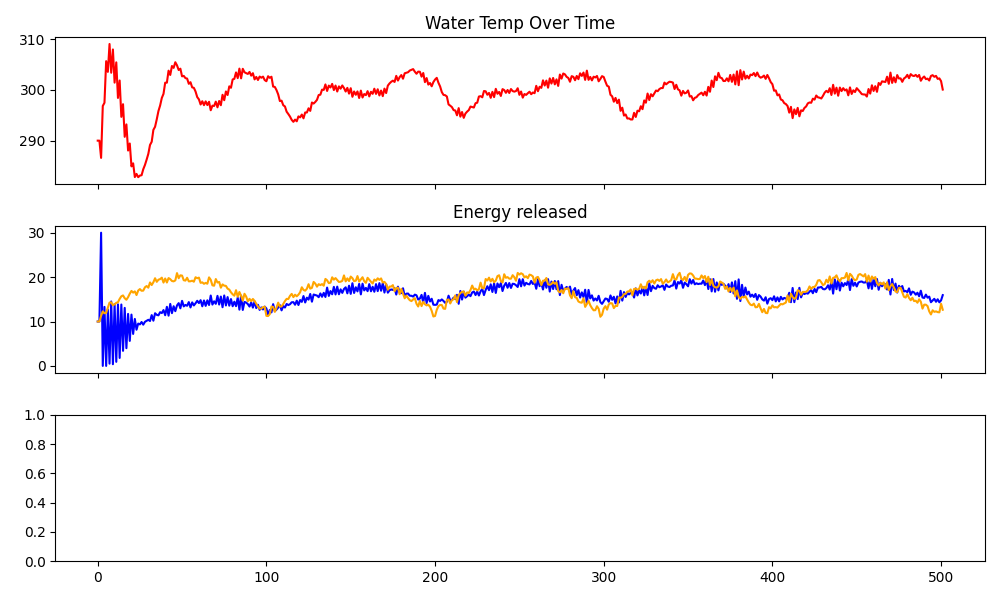

# NuclearControlSim
# 🧠 Nuclear Reactor Control Simulation

A Python simulation of a dual-loop nuclear reactor system controlled by two PID controllers. Designed to emulate physical constraints of real reactors and explore dynamic responses to fluctuating electrical load.

---

## 🔍 Overview

This project simulates heat exchange and control dynamics in a simplified two-loop nuclear reactor system:

- **Primary loop** simulates the reactor core and water coolant system  
- **Secondary loop** transfers heat to a turbine for electricity generation  
- Two **PID controllers** regulate control rod insertion and valve flow rate  
- A **modular electric load function** simulates real-time grid demand  

---

## ⚙️ Features

- 🧪 **Heat transfer simulation** between reactor and water loops  
- 📉 **PID control** of rod height and valve position  
- ⚡️ **Variable electric load** reflecting realistic demand scenarios  
- 🐢 **Unideal actuator model** with delay and movement limits  
- 🧮 **Brute-force PID optimization** to minimize steady-state error  
- 📈 **Graphical output** using Matplotlib for analysis  

---

## 📷 Example Output


```markdown
